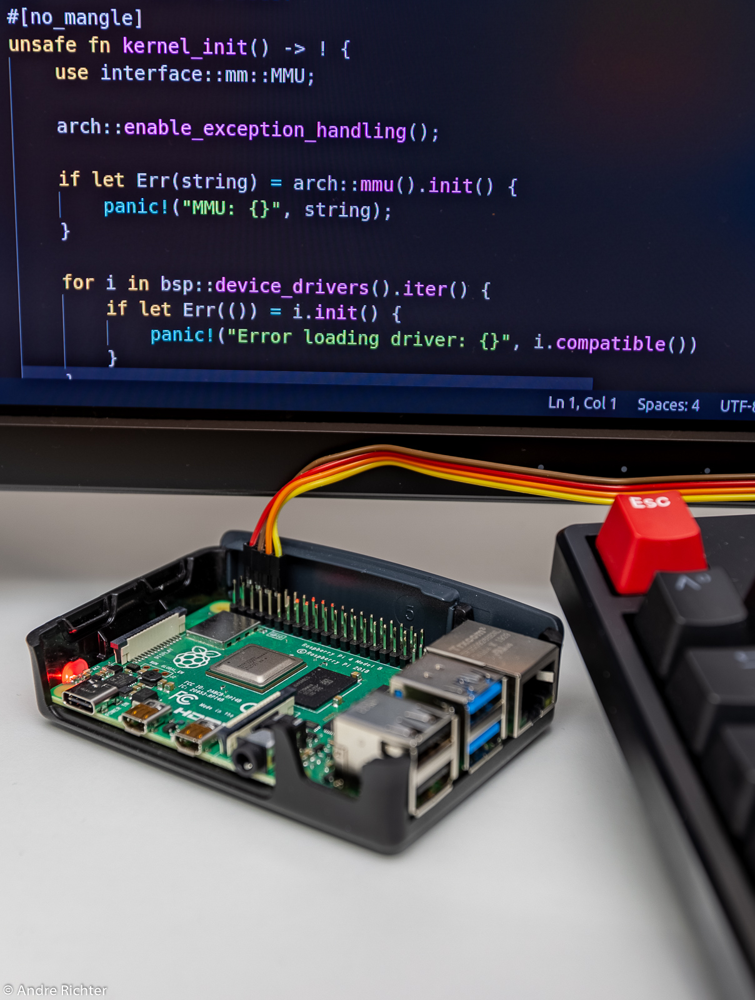
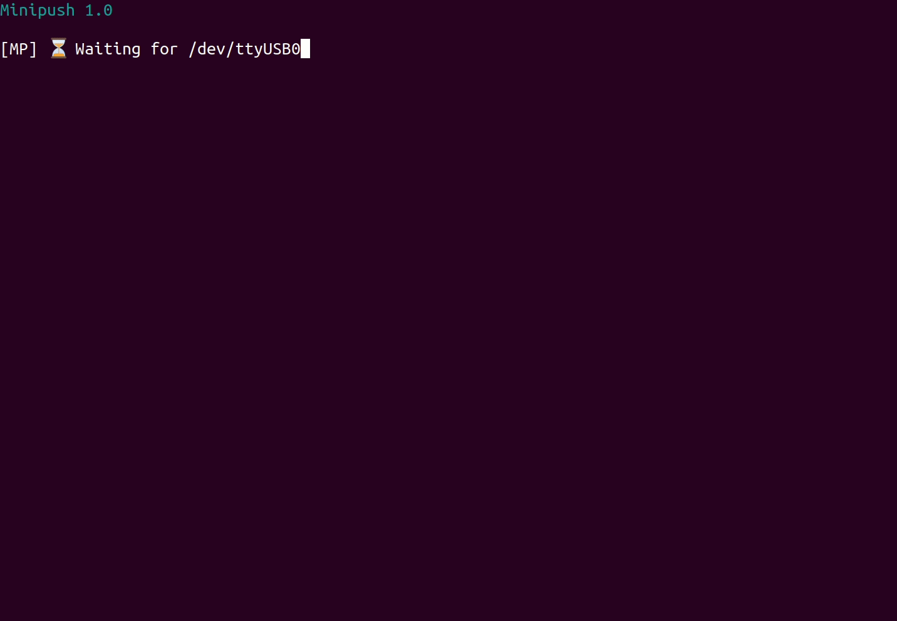
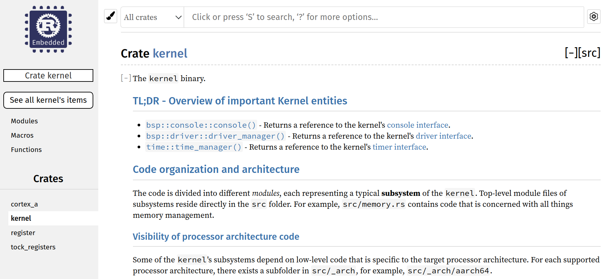
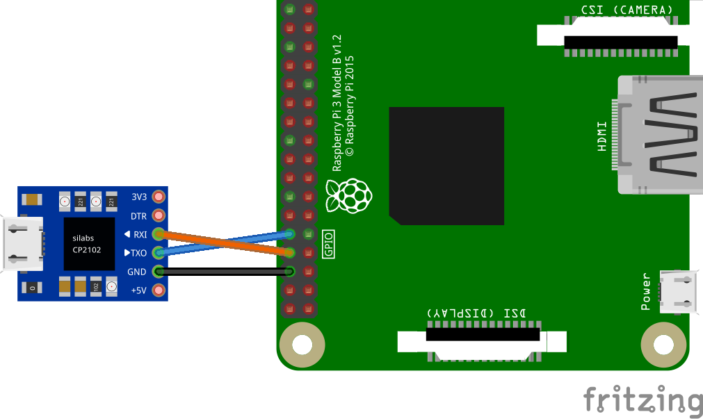

# Raspberry Pi上におけるRustによるオペレーティングシステム開発チュートリアル

    

<br/>

 

## ℹ️ はじめに

このチュートリアル・シリーズは、ARMの64ビット[ARMv8-Aアーキテクチャ]に初めて触れる
ホビーOS開発者のためのものです。このチュートリアルでは、組み込みシステム用の
[モノリシック]なOSカーネルをゼロから書く方法を、ステップ・バイ・ステップで説明します。
このチュートリアルでは、シリアルコンソールへの書き込み、仮想メモリの設定、ハードウェア
例外の処理など、一般的なオペレーティングシステムのタスクの実装をカバーしています。
Rustのユニークな機能を活用して、安全性とスピードを追求します。

楽しんでください。

_<br>Andre ([@andre-richter])_

追伸: 中国語版のチュートリアルが[@colachg]と[@readlnh]により開始されています。
各フォルダにある[`README.CN.md`](README.CN.md)がそれです。ただし、今では少し内容が
古くなっています。

[ARMv8-Aアーキテクチャ]: https://developer.arm.com/products/architecture/cpu-architecture/a-profile/docs
[モノリシック]: https://en.wikipedia.org/wiki/Monolithic_kernel
[@andre-richter]: https://github.com/andre-richter
[@colachg]: https://github.com/colachg
[@readlnh]: https://github.com/readlnh

## 📑 構成

- 各チュートリアルは、スタンドアローンで起動可能な`kerrnl`バイナリを含んでいます。
- 各新規チュートリアルでは、前回のチュートリアルを拡張します。
- 各チュートリアルの`README`には、追加された部分の概要を説明する簡単な`tl;dr`
  セクションがあります。また、前回のチュートリアルのソースコードとの`diff`が表示
  されているので、変更点や追加点を簡単に確認することができます。
    - 一部のチュートリアルでは、`tl;dr`セクションだけでなく、本格的で詳細なテキストが
    掲載されています。長期的には、すべてのチュートリアルに全文を掲載する予定ですが、
    今のところ、`tl;dr`と`diff`だけでは理解できないと思われるチュートリアルに限定
    しています。
- これらのチュートリアルで書かれたコードは**Raspberry Pi 3**と**Raspberry Pi 4**に対応
  しており、動作します。
    - チュートリアル1から5までは、QEMUで動作させることに意味がある基礎的なコードです。
    - [チュートリアル5](05_drivers_gpio_uart)からは、実際のRaspberryにカーネルを
    ロードして実行し、`UART`経由で出力を観察することができます。
- Raspberry Pi 3と4が主なターゲットボードですが、コードはモジュール方式で書かれて
  いるので、他のCPUアーキテクチャやボードにも簡単に移植することができます。
    - 誰かが**RISC-V**の実装に挑戦してくれると嬉しいですね。
- 編集には、[Rust Analyzer]付きの[Visual Studio Code]をお勧めします。
- チュートリアルのテキストに加えて、各チュートリアルで`make doc`コマンドも試して
  みてください。これにより、広範囲に渡ってドキュメント化されたコードを簡単に閲覧
  することができます。

### Output of `make doc`



[Visual Studio Code]: https://code.visualstudio.com
[Rust Analyzer]: https://rust-analyzer.github.io

## 🛠 システム要件

チュートリアルは、主に**Linux**ベースのディストリビューションを対象としています。
ほとんどのものは**macOS**などのUnix類似システムでも動作しますが、これはあくまで
_実験的なもの_ です。

### 🚀 tl;dr

1. [Dockerをインストールします][install_docker].
1. [docker group]にユーザアカウントを追加します.
1. `Rust`ツールチェーンを用意します。ほとんどのものは、最初に使用する際の
   [rust-toolchain](rust-toolchain)ファイルで処理されます。残されているのは次の
   走査だけです。
   1. すでにRustがインストールされている場合、
      ```bash
      cargo install cargo-binutils rustfilt
      ```

   2. Rustを1からインストールする必要がある場合、
      ```bash
      curl --proto '=https' --tlsv1.2 -sSf https://sh.rustup.rs | sh

      source $HOME/.cargo/env
      cargo install cargo-binutils rustfilt
      ```

1. `Visual Studio Code`を試用する場合は[Rust Analyzer extension]をインストールする
   ことを強く勧めます。

1. Linux上で実行してい**いない**場合は、`Ruby` gemが少し必要です。

   ```bash
   sudo gem install bundler
   bundle config set path '.vendor/bundle'
   bundle install
   ```

[docker group]: https://docs.docker.com/engine/install/linux-postinstall/
[Rust Analyzer extension]: https://marketplace.visualstudio.com/items?itemName=matklad.rust-analyzer

### 🧰 更に詳しく: ツールチェーンに格闘しなくてすむようにするために

このシリーズでは、ユーザフレンドリを重視しています。そのため、組み込み開発における
最大の悩みの種である「ツールチェーンとの格闘」を極力排除するようにしました。

Rustはそれ自体が既にそれを大いに助けるものになっています。というのも、Rustには
クロスコンパイルの機能が備わっているからです。`x86`のホストからRaspberry Piの
`AArch64`アーキテクチャへのクロスコンパイルに必要なものはすべて`rustup`によって
自動的にインストールされます。しかし、Rustコンパイラの他にもいくつかのツールを
使用します。次のようなツールです。

- ホストシステム上でカーネルをエミュレートするための`QEMU`
- `UART`経由でオンデマンドでカーネルをRaspberry Piにロードする自作ツールの`Minipush`
- ターゲット上でのデバッグ用に`OpenOCD`と`GDB`

各ツールの正しいバージョンをホストマシンにインストールしたり、コンパイルしたりする
際には、多くの問題があります。たとえば、ディストリビューションが必要な最新バージョンを
提供していないかもしれません。あるいは、これらのツールのコンパイルに必要な、入手困難な
依存関係があるかもしれません。

そのため、可能な限り[Docker][install_docker]を活用します。必要なツールや依存関係が
あらかじめインストールされている付属のコンテナを提供することで、それが必要になったら
自動的に取り込まれるようにしています。Dockerについてもっと知りたい、提供されている
コンテナを覗いてみたいという方は、リポジトリの[docker](docker)フォルダを参照して
ください。

[install_docker]: https://docs.docker.com/get-docker/

## 📟 USBシリアル出力

チュートリアルで開発したカーネルは実際のハードウェア上で動作しますので、そのすべてを
経験するためには、USBシリアルケーブルを用意することを強くお勧めします。

- すぐに使えるUSBシリアルケーブルは [\[1\]] [\[2\]]にありますが、他のケーブルでも
  動作します。ケーブルは`CP2102`チップをベースにしたものが理想的です。
- 下図のように`GND`とGPIOピン`14/15`に接続します。
- USBシリアルが使えるのは[Tutorial 5](05_drivers_gpio_uart)が最初です。そこでは、
  SDカードから自作カーネルを起動するためのSDカードの準備方法を説明しています。
- [tutorial 6](06_uart_chainloader)からは、Raspberryでのカーネルの起動が _とても_
  快適になります。このチュートリアルでは、いわゆる`chainloader`が開発されており、
  このチュートリアルがSDカードに手動でコピーする最後のファイルとなります。これに
  より、`UART`経由でブート時にオンデマンドでチュートリアルのカーネルがロードされる
  ようになります。



[\[1\]]: https://www.amazon.de/dp/B0757FQ5CX/ref=cm_sw_r_tw_dp_U_x_ozGRDbVTJAG4Q
[\[2\]]: https://www.adafruit.com/product/954

## 🙌 謝辞

このチュートリアルのオリジナルバージョンは、[Zoltan Baldaszti](https://github.com/bztsrc)氏による素晴らしいC言語による[RPi3上でのベアメタルプログラミングチュートリアル]
をフォークしたものです。ありがとうございます。

## ライセンス

次のいずれかでライセンスされています。いずれかを選択してください。

- Apache License, Version 2.0, ([LICENSE-APACHE](LICENSE-APACHE) or http://www.apache.org/licenses/LICENSE-2.0)
- MIT license ([LICENSE-MIT](LICENSE-MIT) or http://opensource.org/licenses/MIT)

at your option.

### 貢献

明示的に言及のない限り、提供された貢献はすべて、Apache-2.0ライセンで定義されている
ように追加の利用条件なしに上記のデュアルライセンスになるものとします。
