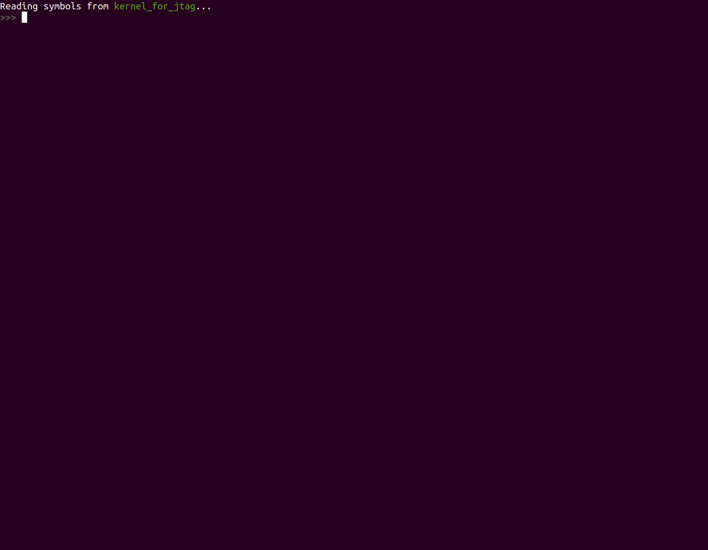
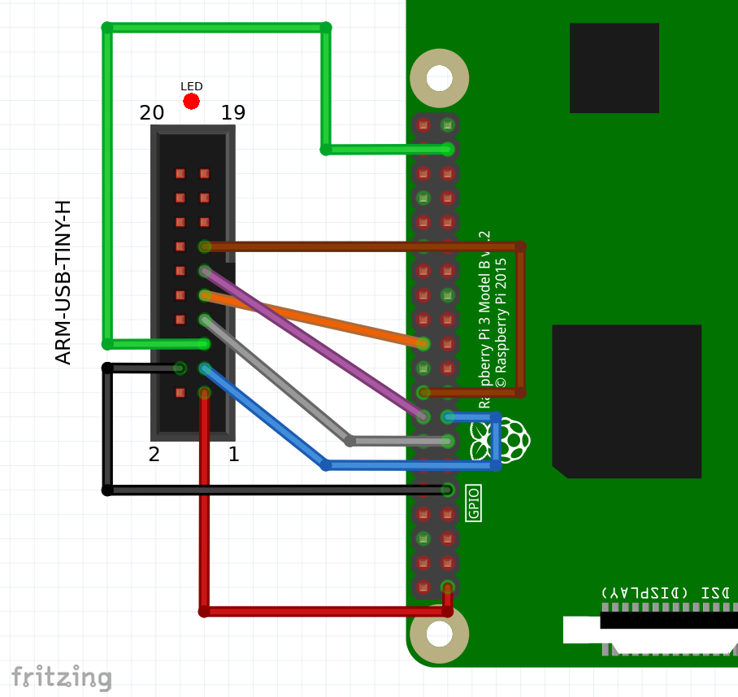
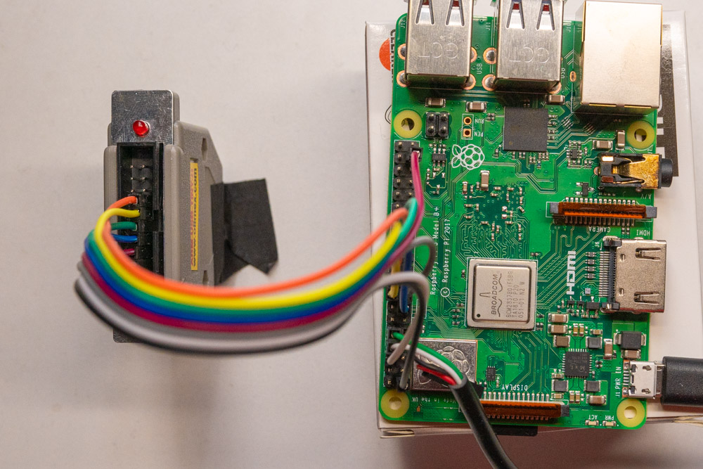

# チュートリアル 08 - JTAGを使ったハードウェアデバッグ

## tl;dr

下記の通りの順番で実行します。

1. `make jtagboot`を実行し、ターミナルを開いておく。
2. USBシリアルデバイスを接続する。
3. `JTAG`デバッガUSBデバイスを接続する。
4. 新しいターミナルで、`make openocd｀を実行し、ターミナルを開いておく。
5. 新しいターミナルで、`make gdb`または`make gdb-opt0`を実行する。



## 目次

- [チュートリアル 08 - JTAGを使ったハードウェアデバッグ](#チュートリアル-08---jtagを使ったハードウェアデバッグ)
  - [tl;dr](#tldr)
  - [目次](#目次)
  - [はじめに](#はじめに)
  - [概要](#概要)
  - [ソフトウェアのセットアップ](#ソフトウェアのセットアップ)
  - [ハードウェアのセットアップ](#ハードウェアのセットアップ)
    - [配線](#配線)
  - [接続の準備](#接続の準備)
  - [OpenOCD](#openocd)
  - [GDB](#gdb)
    - [備考](#備考)
      - [最適化](#最適化)
      - [GDBの制御](#gdbの制御)
  - [USB接続の制約に関する注意事項](#usb接続の制約に関する注意事項)
  - [追加の情報源](#追加の情報源)
  - [謝辞](#謝辞)
  - [前回とのDiff](#前回とのdiff)

## はじめに

今後のチュートリアルでは、デバッグ作業を困難にする可能性のあるRPiのSoCの
デリケートな部分に触れていきます。たとえば、プロセッサの「権限レベル」の
変更や「仮想メモリ」の導入などです。

ハードウェアベースのデバッガは、厄介なバグを探す際の最後の手段になることが
あります。この分野では`QEMU`は助けにならないことがあるからです。なぜなら、
QEMUはハードウェアの特定の機能を抽象化し、最後の1ビットまでシミュレート
しないからです。

そこで、`JTAG`デバッグを導入します。一度セットアップすれば、実際のハードウェア
上でカーネルをシングルステップ実行することができます。すごいでしょう?!

## 概要

カーネルの観点から見ると、このチュートリアルは前回のものと同じです。単に
JTAGデバッグのためのインフラストラクチャでラップしているだけです。

## ソフトウェアのセットアップ

SDカードの`config.txt`ファイルに1行追加する必要があります。

```toml
arm_64bit=1
init_uart_clock=48000000
enable_jtag_gpio=1
```

## ハードウェアのセットアップ

Raspberry Piは、我々のWGが作成している[Embedded Rust Book]（[日本語訳]）で使用している
`STM32F3DISCOVERY`のようなマイコンボードとは異なり、ボード上に組込み
デバッガを搭載していません。そのため、デバッガを購入する必要があります。

このチュートリアルでは、OLIMEX社の[ARM-USB-TINY-H]を使用します。これは
標準的な[ARM JTAG 20コネクタ]を備えています。残念ながら、RPiにはこの
コネクタはありませんので、ジャンパ線で接続する必要があります。

[Embedded Rust Book]: https://rust-embedded.github.io/book/start/hardware.html
[日本語訳]: https://tomoyuki-nakabayashi.github.io/book/
[ARM-USB-TINY-H]: https://www.olimex.com/Products/ARM/JTAG/ARM-USB-TINY-H
[ARM JTAG 20コネクタ]: http://infocenter.arm.com/help/index.jsp?topic=/com.arm.doc.dui0499dj/BEHEIHCE.html

### 配線

<table>
    <thead>
        <tr>
            <th>GPIO #</th>
			<th>名前</th>
			<th>JTAG #</th>
			<th>注記</th>
			<th width="60%">配線図</th>
        </tr>
    </thead>
    <tbody>
        <tr>
            <td></td>
            <td>VTREF</td>
            <td>1</td>
            <td>3.3Vへ</td>
            <td rowspan="8"></td>
        </tr>
        <tr>
            <td></td>
            <td>GND</td>
            <td>4</td>
            <td>GNDへ</td>
        </tr>
        <tr>
            <td>22</td>
            <td>TRST</td>
            <td>3</td>
            <td></td>
        </tr>
        <tr>
            <td>26</td>
            <td>TDI</td>
            <td>5</td>
            <td></td>
        </tr>
        <tr>
            <td>27</td>
            <td>TMS</td>
            <td>7</td>
            <td></td>
        </tr>
        <tr>
            <td>25</td>
            <td>TCK</td>
            <td>9</td>
            <td></td>
        </tr>
        <tr>
            <td>23</td>
            <td>RTCK</td>
            <td>11</td>
            <td></td>
        </tr>
        <tr>
            <td>24</td>
            <td>TDO</td>
            <td>13</td>
            <td></td>
        </tr>
    </tbody>
</table>

<p align="center"></p>

## 接続の準備

起動すると、`config.txt`を変更したおかげで、RPiのファームウェアがそれぞれの
GPIOピンを`JTAG`用に設定します。

あとは、RPiの実行を一時停止して、`JTAG`経由で接続するだけです。そこで
`Makefile`に新規ターゲット`make jtagboot`を追加します。これは、`chainboot`
アプローチを使用して、実行中のコアを待機状態にするだけの小さなヘルパー
バイナリをRPiにロードします。

このヘルパーバイナリは、このリポジトリの`X1_JTAG_boot`フォルダで別に管理
されており、これまでのチュートリアルで使用したカーネルを修正したものです。

[X1_JTAG_boot]: ../X1_JTAG_boot

```console
$ make jtagboot
Minipush 1.0

[MP] ⏳ Waiting for /dev/ttyUSB0
[MP] ✅ Serial connected
[MP] 🔌 Please power the target now
 __  __ _      _ _                 _
|  \/  (_)_ _ (_) |   ___  __ _ __| |
| |\/| | | ' \| | |__/ _ \/ _` / _` |
|_|  |_|_|_||_|_|____\___/\__,_\__,_|

           Raspberry Pi 3

[ML] Requesting binary
[MP] ⏩ Pushing 7 KiB ==========================================🦀 100% 0 KiB/s Time: 00:00:00
[ML] Loaded! Executing the payload now

[    0.394532] Parking CPU core. Please connect over JTAG now.
```

USBシリアルを接続したまま、`jtagboot`を実行したターミナルをそのままに
しておくことが重要です。後で実際のカーネルをロードした時に、`UART`の出力が
ここに表示されます。

## OpenOCD

次に、`JTAG`を実際に接続するために[Open On-Chip Debugger]、通称`OpenOCD`を
起動する必要があります。

[Open On-Chip Debugger]: http://openocd.org

いつものように、私たちのチュートリアルでは開発ツールに関してできる限り手間を
かけないようにしています。そのため、Chainbootingや`QEMU`ですでに使用している
[専用のDockerコンテナ]にすべてをパッケージ化しています。

[専用のDockerコンテナ]: ../docker/rustembedded-osdev-utils

OlimexのUSB JTAGデバッガを接続し、新しいターミナルを開いて、同じフォルダで
`make openocd`と入力します（この順番で！）。次のような初期出力が表示されます。

```console
$ make openocd
[...]
Open On-Chip Debugger 0.10.0
[...]
Info : Listening on port 6666 for tcl connections
Info : Listening on port 4444 for telnet connections
Info : clock speed 1000 kHz
Info : JTAG tap: rpi3.tap tap/device found: 0x4ba00477 (mfg: 0x23b (ARM Ltd.), part: 0xba00, ver: 0x4)
Info : rpi3.core0: hardware has 6 breakpoints, 4 watchpoints
Info : rpi3.core1: hardware has 6 breakpoints, 4 watchpoints
Info : rpi3.core2: hardware has 6 breakpoints, 4 watchpoints
Info : rpi3.core3: hardware has 6 breakpoints, 4 watchpoints
Info : Listening on port 3333 for gdb connections
Info : Listening on port 3334 for gdb connections
Info : Listening on port 3335 for gdb connections
Info : Listening on port 3336 for gdb connections
```

`OpenOCD`はRPiの4つのコアを検出し、`gdb`がそれぞれのコアをデバッグできるように
4つのネットワークポートを開いています。

## GDB

最後に、`AArch64`に対応したバージョンの`gdb`が必要です。推測通り、それは
すでにosdevコンテナにパッケージされています。これは`make gdb`で起動できます。

このMakefileのターゲットは実際にはもう少し多くのことを行います。デバッグ情報を
含む特別バージョンのカーネルをビルドします。これにより`gdb`は現在デバッグして
いる`Rust`のソースコードを表示することができます。また、このデバッグビルド
(`kernel_for_jtag`)をロードするように`gdb`を起動します。

これで`gdb`のコマンドラインを使って以下のことができます。

  1. カーネルにブレークポイントを設定する。
  2. JTAG経由でカーネルをメモリにロードする（現在、RPiは最小限のJTAGブート
     バイナリを実行していることを忘れないでください）。
  3. RPiのプログラムカウンタを操作して、カーネルのエントリポイントから実行を
     開始する。
  4. シングルステップで実行する。

```console
$ make gdb
[...]
>>> target remote :3333                          # Connect to OpenOCD, core0
>>> load                                         # Load the kernel into the RPi's DRAM over JTAG.
Loading section .text, size 0x2454 lma 0x80000
Loading section .rodata, size 0xa1d lma 0x82460
Loading section .got, size 0x10 lma 0x82e80
Loading section .data, size 0x20 lma 0x82e90
Start address 0x0000000000080000, load size 11937
Transfer rate: 63 KB/sec, 2984 bytes/write.
>>> set $pc = 0x80000                            # Set RPI's program counter to the start of the
                                                 # kernel binary.
>>> break main.rs:158
Breakpoint 1 at 0x8025c: file src/main.rs, line 158.
>>> cont
>>> step                                         # Single-step through the kernel
>>> step
>>> ...
```

### 備考

#### 最適化

OSのバイナリをデバッグする際には、ステップ実行できるRustのソースコードの粒度と
生成されるバイナリの最適化レベルの間でトレードオフを行う必要があります。`make`
と`make gdb`ターゲットは、最適化レベル 3 (`-opt-level=3`) の`--release`
バイナリを生成します。しかし、この場合、コンパイラは非常に積極的にインライン
化を行い、可能な限りリードとライトを一体化します。その結果、ソースコード
ファイルの希望の行に正確にブレークポイントを設定できるとは限りません。

このため、Makefileには`-opt-level=0`を使用する`make gdb-opt0`ターゲットも
用意されており、より詳細なデバッグが可能になります。ただし、HWを密接に扱う
コードをデバッグする際には、揮発性レジスタへの読み書きを潰すようなコンパイラの
最適化が実行時に大きな違いを生じさせることを覚えておいてください。参考までに、
上のデモGIFは`gdb-opt0`で記録されています。

#### GDBの制御

ある時点で、遅延ループやシリアルからのユーザ入力を待つコードに到達する場合が
あります。この場合、シングルステップが実行できなくなったり、機能しなくなったり
する可能性があります。このような場合は、これらの領域の先に別のブレークポイントを
設定し、`cont`コマンドを使用してこのブレークポイントまで飛ぶことで、この問題を
克服することができます。

`gdb`で`ctrl+c`を押すと、ブレークポイントを設定せずに実行を続けた場合、RPiの
実行が再び停止します。

## USB接続の制約に関する注意事項

このチュートリアルに最初から最後まで従っていれば、USB接続に関してはすべて
問題ないはずです。

しかし、現在のMakefileは、接続されるUSBデバイスの名前について暗黙の前提を
置いていることに注意してください。つまり、`/dev/ttyUSB0`が`UART`デバイスで
あることを想定しています。

したがって、あなたのボックスにデバイスを接続する際には、以下の順序を確認して
ください。

  1. USBシリアルを接続する。
  2. その後、Olimexデバッガを接続する。

これによりホストOSはデバイスを正しく列挙します。この作業が必要なのは一度だけ
です。たとえば、デバッガを接続したまま、もう一度、`make jtagboot`を起動
するために、シリアルを何度も切断したり接続したりしても構いません。

## 追加の情報源

- https://metebalci.com/blog/bare-metal-raspberry-pi-3b-jtag
- https://www.suse.com/c/debugging-raspberry-pi-3-with-jtag

## 謝辞

このチュートリアルの土台を作ってくれた[@naotaco](https://github.com/naotaco)に
感謝します。

## 前回とのDiff

```diff

diff -uNr 07_timestamps/Cargo.toml 08_hw_debug_JTAG/Cargo.toml
--- 07_timestamps/Cargo.toml
+++ 08_hw_debug_JTAG/Cargo.toml
@@ -1,6 +1,6 @@
 [package]
 name = "mingo"
-version = "0.7.0"
+version = "0.8.0"
 authors = ["Andre Richter <andre.o.richter@gmail.com>"]
 edition = "2018"


diff -uNr 07_timestamps/Makefile 08_hw_debug_JTAG/Makefile
--- 07_timestamps/Makefile
+++ 08_hw_debug_JTAG/Makefile
@@ -23,6 +23,8 @@
     OBJDUMP_BINARY    = aarch64-none-elf-objdump
     NM_BINARY         = aarch64-none-elf-nm
     READELF_BINARY    = aarch64-none-elf-readelf
+    OPENOCD_ARG       = -f /openocd/tcl/interface/ftdi/olimex-arm-usb-tiny-h.cfg -f /openocd/rpi3.cfg
+    JTAG_BOOT_IMAGE   = ../X1_JTAG_boot/jtag_boot_rpi3.img
     LINKER_FILE       = src/bsp/raspberrypi/link.ld
     RUSTC_MISC_ARGS   = -C target-cpu=cortex-a53
 else ifeq ($(BSP),rpi4)
@@ -34,6 +36,8 @@
     OBJDUMP_BINARY    = aarch64-none-elf-objdump
     NM_BINARY         = aarch64-none-elf-nm
     READELF_BINARY    = aarch64-none-elf-readelf
+    OPENOCD_ARG       = -f /openocd/tcl/interface/ftdi/olimex-arm-usb-tiny-h.cfg -f /openocd/rpi4.cfg
+    JTAG_BOOT_IMAGE   = ../X1_JTAG_boot/jtag_boot_rpi4.img
     LINKER_FILE       = src/bsp/raspberrypi/link.ld
     RUSTC_MISC_ARGS   = -C target-cpu=cortex-a72
 endif
@@ -65,9 +69,12 @@
 DOCKER_CMD           = docker run --rm -v $(shell pwd):/work/tutorial -w /work/tutorial
 DOCKER_CMD_INTERACT  = $(DOCKER_CMD) -i -t
 DOCKER_ARG_DIR_UTILS = -v $(shell pwd)/../utils:/work/utils
+DOCKER_ARG_DIR_JTAG  = -v $(shell pwd)/../X1_JTAG_boot:/work/X1_JTAG_boot
 DOCKER_ARG_DEV       = --privileged -v /dev:/dev
+DOCKER_ARG_NET       = --network host

 DOCKER_QEMU  = $(DOCKER_CMD_INTERACT) $(DOCKER_IMAGE)
+DOCKER_GDB   = $(DOCKER_CMD_INTERACT) $(DOCKER_ARG_NET) $(DOCKER_IMAGE)
 DOCKER_TOOLS = $(DOCKER_CMD) $(DOCKER_IMAGE)

 # Dockerize commands that require USB device passthrough only on Linux
@@ -75,12 +82,17 @@
     DOCKER_CMD_DEV = $(DOCKER_CMD_INTERACT) $(DOCKER_ARG_DEV)

     DOCKER_CHAINBOOT = $(DOCKER_CMD_DEV) $(DOCKER_ARG_DIR_UTILS) $(DOCKER_IMAGE)
+    DOCKER_JTAGBOOT  = $(DOCKER_CMD_DEV) $(DOCKER_ARG_DIR_UTILS) $(DOCKER_ARG_DIR_JTAG) $(DOCKER_IMAGE)
+    DOCKER_OPENOCD   = $(DOCKER_CMD_DEV) $(DOCKER_ARG_NET) $(DOCKER_IMAGE)
+else
+    DOCKER_OPENOCD   = echo "Not yet supported on non-Linux systems."; \#
 endif

 EXEC_QEMU     = $(QEMU_BINARY) -M $(QEMU_MACHINE_TYPE)
 EXEC_MINIPUSH = ruby ../utils/minipush.rb

-.PHONY: all $(KERNEL_ELF) $(KERNEL_BIN) doc qemu chainboot clippy clean readelf objdump nm check
+.PHONY: all $(KERNEL_ELF) $(KERNEL_BIN) doc qemu chainboot jtagboot openocd gdb gdb-opt0  clippy \
+    clean readelf objdump nm check

 all: $(KERNEL_BIN)

@@ -107,6 +119,19 @@
 chainboot: $(KERNEL_BIN)
 	@$(DOCKER_CHAINBOOT) $(EXEC_MINIPUSH) $(DEV_SERIAL) $(KERNEL_BIN)

+jtagboot:
+	@$(DOCKER_JTAGBOOT) $(EXEC_MINIPUSH) $(DEV_SERIAL) $(JTAG_BOOT_IMAGE)
+
+openocd:
+	$(call colorecho, "\nLaunching OpenOCD")
+	@$(DOCKER_OPENOCD) openocd $(OPENOCD_ARG)
+
+gdb: RUSTC_MISC_ARGS += -C debuginfo=2
+gdb-opt0: RUSTC_MISC_ARGS += -C debuginfo=2 -C opt-level=0
+gdb gdb-opt0: $(KERNEL_ELF)
+	$(call colorecho, "\nLaunching GDB")
+	@$(DOCKER_GDB) gdb-multiarch -q $(KERNEL_ELF)
+
 clippy:
 	@RUSTFLAGS="$(RUSTFLAGS_PEDANTIC)" $(CLIPPY_CMD)

```
